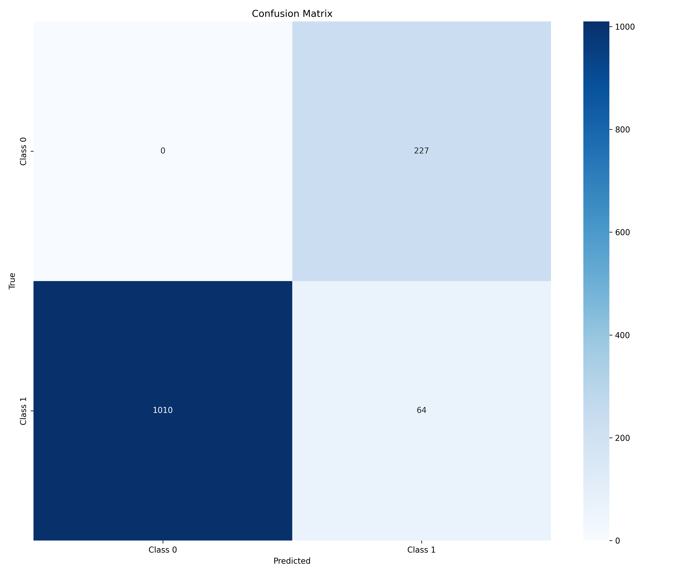
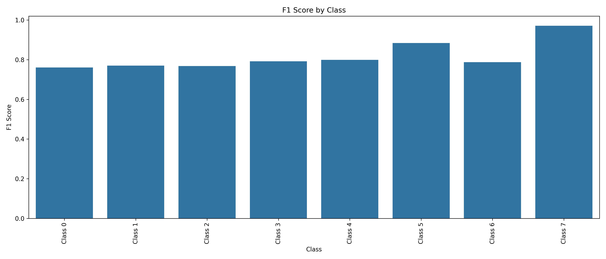
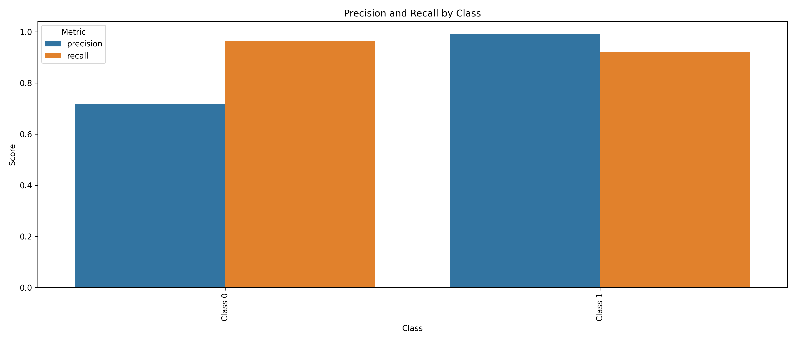
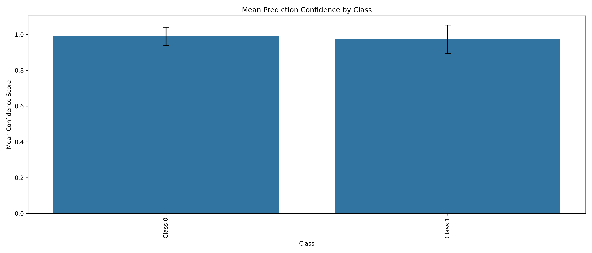

# TinyML with MCUNet

This is a fork of the MCUNet repository for utilizing TinyML to accelerate ML inferencing on microcontrollers and resource-constrained devices.

## Overview

MCUNet is a framework designed to bring deep learning to IoT devices with extremely limited computing resources. This project extends MCUNet with additional tools for training, evaluation, and deployment of models for specific applications.

## Getting Started

### Prerequisites

* Python 3.8+ 
* CUDA-compatible GPU (optional, for faster training)
* At least 8GB RAM
* git
* Virtual Environment (Conda or Python)

### Installation

* Note: This implementation using conda virtual environment. You could also use the python virtual environment. 

1. Clone this repository:
```bash
git clone https://github.com/Spring317/tinyML.git
cd tinyML
```

2. Create and activate a conda environment:
```bash
conda create -n tinyml 
conda activate tinyml
pip install -r requirements.txt
```

* Note: This implementation will deploy the model to raspberry pi 4 using ONNX framework. If you wish to deploy the model on the micro-controler, please refer to [tinyengine](https://github.com/mit-han-lab/tinyengine) repo

## Training and validating:

1. Creating dataset:
```bash
# Please refer to this repo https://github.com/visipedia/inat_comp/tree/master/2017 if you having problem with the dataset
wget https://ml-inat-competition-datasets.s3.amazonaws.com/2017/train_val_images.tar.gz

tar -xvzf train_val_images.tar.gz
```  

2. Modify the config.yaml file to point to your data directory:
```yaml

global:
   # In this experiment, we only use the Insecta class from the iNaturalist dataset
   # Add more superclasses if you wish to use more classes
   included_classes: ["Insecta"]
   verbose: false
   overwrite: true

#Modify these paths to the dataset you want to use
paths:
   #path for the dataset you just downloaded
   src_dataset: "/home/quydx/mcunet_full/inat_2017"
   #path for the sub-dataset you want to do training and validation (e.g. haute_garonne)
   dst_dataset: "/home/quydx/iNaturelist_transfer_learning_pytorch/data/haute_garonne"

   #I am too lazy to change the path in the code, so I just put it here. Please don't touch it T.T
   web_crawl_output_json: "/home/quydx/iNaturelist_transfer_learning_pytorch/output/haute_garonne.json"
   output_dir: "/home/quydx/iNaturelist_transfer_learning_pytorch/output"

#In case you want to have more updated dataset, you can use the web_crawl to download the latest data from iNaturalist
#Else don't touch this part
web_crawl:
total_pages: 104
base_url: "https://www.inaturalist.org/check_lists/32961-Haute-Garonne-Check-List?page="
delay_between_requests: 1.0

#Modify these parameters to your needs
train_val_split:
train_size: 0.8
random_state: 42
dominant_threshold: 0.9
```

3.  Great! Now you could start the training with very *Easy* command:
```bash
   # Default settings
   python train.py

   # Custom settings
   python train.py --epochs 100 --model mcunet-in4 --threshold 0.7

   # With custom image size
   python train.py --img_size 224 224 --batch_size 32

   # Full custom configuration
   python train.py --epochs 150 --model mcunet-in2 --threshold 0.6 \
                  --batch_size 32 --lr 0.0005 --workers 4 \
                  --img_size 192 192 --output_dir models/custom

```

4. Afterward you could make some *easy* validation based on the val.py script
```bash
   python3 eval.py
```

5.  You are good to go! Now all you have to do is to quantize the model and deploy it on the Pi
```bash
   python3 quantize.py
```

6.  For Deploying into Raspberry Pi 4b, please refer to the deployment repo [here]()

## Results:

### Experimental setup:

* Superclass: Insecta 
* Dominant classes: 7 classes (Cover 50% of ther dominant species in the Insecta dataset)
* Epoch: 50
* Batch size: 64
* Learning read: 0.001
* Number of worker: 8
* Model type: mcunet-in2
* Image size: 160x160

### Results: 

#### Confusion Matrix


#### Class F1 Scores


#### Precision and Recall by Class


#### Class Confidence Distribution



## References

### Papers
1. Lin, J., Chen, W. M., Lin, Y., Gan, C., & Han, S. (2020). [MCUNet: Tiny Deep Learning on IoT Devices](https://arxiv.org/abs/2007.10319). *Advances in Neural Information Processing Systems (NeurIPS)*.

2. Lin, J., Chen, W. M., Lin, Y., Coles, J., Critically, A., Chen, W., Chen, M., Zhang, M., Zhou, Y., Han, S. (2021). [MCUNetV2: Memory-Efficient Patch-based Inference for Tiny Deep Learning](https://arxiv.org/abs/2110.15352). *Advances in Neural Information Processing Systems (NeurIPS)*.

3. Lin, J., Chen, M., Zhang, M., Zhou, Y., & Han, S. (2022). [MCUNetV3: On-Device Training Under 256KB Memory](https://arxiv.org/abs/2206.15472). *Advances in Neural Information Processing Systems (NeurIPS)*.

4. Liberis, E., & Lane, N. D. (2021). [Neural networks on microcontrollers: saving memory at inference via operator reordering](https://arxiv.org/abs/2105.04209). *Conference on Machine Learning and Systems (MLSys)*.

### Code Repositories
1. [Original MCUNet Repository](https://github.com/mit-han-lab/mcunet) - The official implementation of MCUNet from MIT Han Lab.

2. [TinyEngine](https://github.com/mit-han-lab/tinyengine) - Optimized inference engine for microcontrollers.

3. [TF Micro](https://github.com/tensorflow/tflite-micro) - TensorFlow Lite for Microcontrollers.

4. [ONNX Runtime](https://github.com/microsoft/onnxruntime) - Cross-platform inference accelerator.

### Datasets
1. [iNaturalist 2017](https://github.com/visipedia/inat_comp/tree/master/2017) - Large-scale species classification dataset.
   
2. [iNaturalist Dataset Builder](https://github.com/HoangPham6337/iNaturelist_dataset_builder) - Dataset crawling and preprocessing. 

### Tutorials & Documentation
1. [TinyML: Machine Learning with TensorFlow Lite](https://www.tensorflow.org/lite/microcontrollers) - Official TensorFlow documentation for microcontroller deployment.

2. [Deploying Edge AI: A Practical Guide to Hardware Considerations](https://www.arm.com/resources/white-paper/edge-ai) - Arm's guide to edge AI deployment.

3. [ONNX Model Zoo](https://github.com/onnx/models) - Collection of pre-trained, state-of-the-art models in the ONNX format.

4. [PyTorch to ONNX Tutorial](https://pytorch.org/tutorials/advanced/super_resolution_with_onnxruntime.html) - Official PyTorch tutorial for ONNX export.

### Tools & Libraries
1. [ONNX Runtime Quantization](https://onnxruntime.ai/docs/performance/quantization.html) - Documentation for quantizing ONNX models.

2. [PyTorch Quantization](https://pytorch.org/docs/stable/quantization.html) - PyTorch's quantization support documentation.

3. [Raspberry Pi Documentation](https://www.raspberrypi.org/documentation/) - Official Raspberry Pi documentation.

## Acknowledgements

This work was built upon the foundation laid by the MIT Han Lab's research on TinyML and edge computing. We would like to thank the original authors of MCUNet for their groundbreaking work in bringing deep learning to microcontroller-class devices.

We also acknowledge the contributors to the iNaturalist dataset, which has been instrumental in training and evaluating our models for species classification.

## Citation

If you use this codebase for your research, please cite the original MCUNet papers:

```
@article{lin2020mcunet,
  title={Mcunet: Tiny deep learning on iot devices},
  author={Lin, Ji and Chen, Wei-Ming and Lin, Yujun and Gan, Chuang and Han, Song},
  journal={Advances in Neural Information Processing Systems},
  volume={33},
  year={2020}
}

@inproceedings{
  lin2021mcunetv2,
  title={MCUNetV2: Memory-Efficient Patch-based Inference for Tiny Deep Learning},
  author={Lin, Ji and Chen, Wei-Ming and Cai, Han and Gan, Chuang and Han, Song},
  booktitle={Annual Conference on Neural Information Processing Systems (NeurIPS)},
  year={2021}
} 

@article{
  lin2022ondevice, 
  title = {On-Device Training Under 256KB Memory},
  author = {Lin, Ji and Zhu, Ligeng and Chen, Wei-Ming and Wang, Wei-Chen and Gan, Chuang and Han, Song}, 
  journal = {arXiv:2206.15472 [cs]},
  url = {https://arxiv.org/abs/2206.15472},
  year = {2022}
}
```
